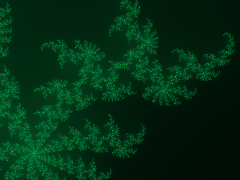

# Julia fractal in HDR

All fractal images on the internet are 8-bit, which sucks. This project generates the Julia fractal in 16 bit, so you can set it as wallpaper on a modern HDR monitor (10+ bits). Windows 11 will supposedly support HDR wallpapers in JXR format.  

  

